```{r setup, include=FALSE}
knitr::opts_chunk$set(echo = TRUE)
```

---

## 1. Motivation and Potential Impact

Cerebrovascular diseases — including stroke, aneurysm, and arteriovenous malformation — are among the leading causes of mortality and long-term disability worldwide. Accurate, automated segmentation of brain vessels from **Computed Tomography Angiography (CTA)** is a core component of modern clinical neurology pipelines: it directly enables automated stroke volume estimation, aneurysm morphology analysis, surgical pre-planning for endovascular interventions, and hemodynamic simulation for predicting rupture risk.

However, 3D brain vessel segmentation is genuinely among the most difficult problems in the field of medical image analysis for several compounding reasons:

1. **Extreme class imbalance**: Vessel voxels typically occupy less than 2–3% of the total CTA volume. Background brain tissue, bone, and air account for the vast majority, meaning a naive model that predicts all-background achieves >97% voxel accuracy while being clinically useless.

2. **High anatomical complexity and inter-patient variability**: The Circle of Willis and its extending branches exhibit significant variation in presence, dominance, and branching pattern. Some structures (e.g., the third A2 segment) are absent in a large fraction of the population. The dataset used in this project (derived from the TopBrain/TopCoW challenge) includes 40 distinct labelled vessel classes.

3. **Geometric fragility of thin vessels**: Many critical vessels — the anterior communicating artery (Acom), the A1/A2 segments of the anterior cerebral artery, the P1/P2 segments of the posterior cerebral artery, and the superior cerebellar arteries — are only **2–4 voxels wide** even after resampling to 0.6 mm isotropic spacing. For a structure 2 voxels wide, a 1-voxel spatial offset in the prediction collapses the Dice coefficient to zero, making standard volumetric metrics extremely noisy and unreliable for guiding model training on these classes.

4. **Topological sensitivity**: Many clinical applications require not just correct voxel counts but topologically connected vessel trees. A segmentation that is 90% volumetrically correct but has a severed basilar artery is clinically worthless. Standard Dice loss has no mechanism to penalize disconnected predictions.

This project directly addresses these challenges through a multi-component approach: a full 3D U-Net pipeline built from scratch with careful patch sampling design, several targeted loss function augmentations (Tversky and centerline Dice), and a comparison against the state-of-the-art nnU-Net framework. The potential impact of successfully solving thin-vessel topology is that the outputs can be directly ingested into CFD (Computational Fluid Dynamics) solvers for patient-specific hemodynamic modelling — a task that is currently done manually and is a major bottleneck in clinical research.

**Code availability**: The full implementation is available at [github.com/MahsaAbadian/brain_cta](https://github.com/MahsaAbadian/brain_cta).

---

## 2. Data, Preprocessing, and Resampling

### 2.1. Dataset Description

This project uses data from the **TopBrain Segmentation Challenge for Whole Brain Vessel Anatomy** ([topbrain2025.grand-challenge.org](https://topbrain2025.grand-challenge.org)), a MICCAI 2025 challenge that extends the earlier **TopCoW** challenge ([topcow23.grand-challenge.org](https://topcow23.grand-challenge.org)) beyond the Circle of Willis to cover all major landmark arteries and veins of the brain. TopBrain provides the first publicly available dataset with voxel-level annotations across 40+ vessel classes for both CTA and MRA modalities [1]. The training set consists of **25 patients** with both images and full annotations; the test set holds 20 patients from the internal TopCoW test split. Training data (images and label maps) is publicly released on **Zenodo** and can be accessed via the challenge data page linked above. Evaluation focuses on topological correctness — centerline continuity, connected-component counts, and neighbourhood relationships — in addition to standard Dice overlap.

The raw training dataset consists of 3D CTA volumes stored in the NIfTI format (`.nii.gz`), paired with voxel-level integer label maps. The label map defines 40 foreground vascular classes (class IDs 1–40) plus background (class 0). Class names are read at runtime from an ITK-SNAP format labelmap text file (`labelmap_topbrain_ct.txt`) that maps each integer index to a human-readable name (e.g., `"BA"` for Basilar Artery, `"R-ICA"` for Right Internal Carotid Artery).

Initial inspection of the raw data revealed important properties:
- **Anisotropic voxel spacing**: Raw CTA acquisitions are commonly anisotropic, with coarser resolution along the slice (z) axis (e.g., 0.4×0.4×0.75 mm), a property that must be corrected before training a 3D model that applies isotropic `3×3×3` convolutional kernels.
- **High dynamic range**: CTA Hounsfield Unit (HU) values span roughly -1000 to +3000, with vessels enhanced by contrast agent to ~150–400 HU. Training a neural network on raw HU values is impractical due to input distribution instability.

### 2.2. The Resampling Decision

A key early design decision was **whether to resample online (inside the DataLoader) or offline (as a one-time preprocessing step)**. Online resampling is appealing because no disk space is wasted and the pipeline is simpler, but it was ruled out because resampling a full 3D CTA volume using `scipy.ndimage.zoom` takes 5–15 seconds per volume on a CPU. With multiple DataLoader workers and GPU-paced training, this would have made data loading the dominant bottleneck.

The decision was made to run resampling **offline, once, using `src/preprocess_resample.py`**, saving the results to `training_data_resampled/`. The DataLoader then reads directly from the preprocessed copies with no on-the-fly computation.

### 2.3. Resampling Implementation (`src/preprocess_resample.py`, `src/data_utils.py`)

The resampling pipeline (`src/data_utils.py`) operates as follows for each case:

1. **Read the affine matrix** from the NIfTI header using `nibabel`. The voxel spacing is extracted with the formula:

$$\text{spacing}_i = \sqrt{\sum_j A_{ji}^2}$$

where $A$ is the $3 \times 3$ upper-left submatrix of the NIfTI affine. This computes the L2 norm of each column, which is exactly the physical length of one voxel step along each axis.

2. **Compute zoom factors** as `current_spacing / target_spacing`, where the target is `(0.6, 0.6, 0.6)` mm. A volume with original spacing `(0.4, 0.4, 0.75)` mm would receive zoom factors of `(0.667, 0.667, 1.25)`, expanding the slice dimension and slightly shrinking the in-plane dimensions.

3. **Resample the image** using bilinear interpolation (`order=1` in `scipy.ndimage.zoom`) to avoid the staircase artifacts of nearest-neighbour while still being computationally tractable.

4. **Resample the label** using nearest-neighbour interpolation (`order=0`). This is critical: bilinear interpolation on integer class labels would produce fractional values (e.g., `0.5` between class 1 and class 2) that would corrupt the categorical annotations.

5. **Normalize the CT intensity** by clipping to the window `[-100, 400]` HU (capturing soft tissue and contrast-enhanced vessels while discarding bone and air extremes) and then linearly rescaling to `[0, 1]`:

$$x_\text{norm} = \frac{\text{clip}(x, -100, 400) - (-100)}{400 - (-100)}$$

The `-100` lower bound is justified because brain parenchyma sits around 20–40 HU, and values below -100 correspond exclusively to air pockets. The `400` upper bound is chosen to include the peak enhancement of contrast-filled large vessels while excluding calcifications (~500–1500 HU) and bone (~700+ HU) that are not relevant to vessel segmentation.

### 2.4. Dataset Validation (`src/inspect_data.py`)

After preprocessing, a dedicated inspection script loaded random cases from `training_data_resampled/` and verified:
- Shape equality between the resampled image and label (a mismatch would indicate a resampling bug).
- Label value range (min 0, max ≤ 40).
- Affine consistency and near-isotropic spacing.
- Qualitative overlay visualizations saved as `.png` files for visual sanity-checking that vessel boundaries were preserved through the resampling.

```{r data-raw-vs-preprocessed, echo=FALSE, fig.cap="Raw vs. resampled CTA volumes: axial, coronal, and sagittal slices before and after 0.6 mm isotropic resampling. Note the change in slice thickness along the z-axis and the preserved vessel contrast.", out.width="100%"}
knitr::include_graphics("data_inspection/inspect_data_raw_vs_preprocessed.png")
```

```{r data-preprocessed-slices, echo=FALSE, fig.cap="Resampled CTA slices across three orthogonal planes, confirming near-isotropic appearance after resampling.", out.width="100%"}
knitr::include_graphics("data_inspection/inspect_data_preprocessed.png")
```

```{r data-preprocessed-overlay, echo=FALSE, fig.cap="Vessel label overlay on the resampled CTA volume. Each colour corresponds to a distinct vessel class (1–40); the overlay confirms spatial alignment between the image and label after resampling.", out.width="100%"}
knitr::include_graphics("data_inspection/inspect_data_preprocessed_overlay.png")
```

```{r data-labels, echo=FALSE, fig.cap="Vessel label class distribution: voxel counts per foreground class across the training set, illustrating the extreme class imbalance between large structures (SSS, ICA) and rare thin vessels (Acom, PICA, BVR).", out.width="100%"}
knitr::include_graphics("data_inspection/inspect_data_labels.png")
```

---

## 3. Data Loading and Patch Sampling Strategy

### 3.1. The Patch Size Decision

Full 3D CTA volumes (e.g., 332 × 417 × 184 voxels after resampling) are impossible to fit into GPU VRAM for a 3D U-Net with 41 output classes. With `float32` activations, a single volume at this size would require tens of gigabytes just for encoder feature maps. The standard approach is to train on fixed-size 3D **patches** (sub-volumes).

Choosing the patch size required balancing three competing constraints:

1. **GPU VRAM**: A larger patch costs more memory. With a `base_ch=16` U-Net, a `128³` patch at batch size 1 uses approximately 10–12 GB of VRAM including activations and the 41-channel output. A `96³` patch fits in ~4–5 GB.

2. **Anatomical context**: The model needs enough surrounding tissue in each patch to perform *semantic* reasoning, not just local texture matching. For example, distinguishing the Right M1 from the Left M1 segment requires seeing both sides of the midline simultaneously, which requires a large field of view. At 0.6 mm isotropic spacing, a `128³` patch covers ~76 mm — roughly the full width of a human brain. A `96³` patch covers ~57 mm, which can still accommodate bilateral anatomy if the patch is centred on a midline structure.

3. **U-Net divisibility**: The 4-level pooling architecture (4× `MaxPool3d(2)`) requires the patch dimensions to be divisible by $2^4 = 16$. Both 96 ($= 16 \times 6$) and 128 ($= 16 \times 8$) satisfy this. The `_match_size` safety interpolation in `UNet3D.forward` handles residual rounding errors from odd-dimensioned inputs but is rarely triggered in practice.

The final decision was to use `128×128×128` patches as the primary configuration (matching the default in `src/train.py`), with `96×96×96` as a fallback for constrained hardware environments.

### 3.2. Why Pure Random Cropping Fails

The first naive instinct is to pick random crop origins for each training patch. This was explicitly rejected because brain vessels occupy less than 3% of the resampled volume. A purely random `128³` crop from a `332×417×184` resampled volume would contain at least one foreground voxel with probability roughly:

$$P(\text{at least one vessel voxel}) \approx 1 - \left(1 - 0.03\right)^{128^3} \approx 1$$

However, the *centre* of the crop is often in background, meaning the model receives a patch that is >97% background in expectation. The gradient signal from the Dice loss on a near-empty patch is nearly zero, leading to extremely slow convergence on vessel classes.

### 3.3. Foreground-Aware + Minimum Center Distance Sampling (Option D)

The implemented strategy (`sample_patches_option_d` in `src/data_loader.py`) combines two mechanisms:

**Foreground-aware centering (Option B)**: A configurable probability `fg_prob` (default `0.6`) is used each time a patch is sampled. With probability `fg_prob`, a random voxel with label > 0 is selected from the label map, and the patch is centred on that voxel (clamped to stay within volume bounds). With probability `1 - fg_prob`, a purely random origin is used to ensure the model also learns background context.

**Rare-class targeting**: An additional probability `rare_class_prob` (default `0.35`) is applied before the foreground/background coin flip. If triggered, instead of sampling from all foreground voxels uniformly, the sampler first selects a **class** by drawing from a weighted distribution that overrepresents rare classes, then samples a voxel belonging to that class. Three weighting modes were implemented:
- `presence`: weight inversely proportional to the number of training cases in which the class appears (e.g., a class present in only 5/25 cases gets weight 5×).
- `voxel`: weight inversely proportional to the square root of the total voxel count (down-weights large structures like the Superior Sagittal Sinus relative to tiny structures like the Acom).
- `hybrid` (default): geometric mean of the presence and voxel weights, balancing both axes of rarity.

**Minimum center distance (Option D)**: After selecting each patch position, the Euclidean distance between its centre and all previously accepted patch centres in the same volume is computed. If any distance is less than `min_dist` (default = `0.5 × max_patch_dimension`), the candidate is rejected and re-sampled. This prevents the model from seeing the same vessel cross-section multiple times per volume per epoch. A maximum of 50 re-sampling attempts is allowed before falling back to the last candidate.

This combined strategy ensures that every training batch contains at least some vessel voxels, rare classes receive gradient updates at approximately equal rates, and data diversity within an epoch is maximized.

### 3.4. Split Generation and K-Fold Cross-Validation (`scripts/make_splits.py`)

A canonical **K-fold cross-validation** split file (`splits_final.json`) was generated using `scripts/make_splits.py`. The format is a JSON list of `{"train": [...], "val": [...]}` dictionaries, one entry per fold, which is **identical to the format used by nnU-Net v2**. This was a deliberate decision: by sharing the same split file, the baseline 3D U-Net and nnU-Net results are directly comparable with zero chance of data leakage from split differences.

The total available cohort is 25 CTA cases; the split file holds **5 folds of 20 train / 5 val**. All experiments reported in this document were run on **fold 0** (the canonical first fold) to keep the iteration cycle short while remaining directly comparable to the corresponding nnU-Net fold. With 5 validation cases, single-case classification noise on rare classes can shift per-class Dice by up to 0.20 absolute per epoch — this is precisely why the diagnostic work in Section 7 had to lean on *patterns across multiple classes* rather than isolated per-class numbers.

The split generator uses a fixed random seed (`seed=12345`, matching nnU-Net's internal default) and performs stratified shuffling to ensure rare anatomical variants (e.g., cases with absent A3 segments) are distributed across folds rather than concentrated in one.

**Stratified split generation** (`--stratify-by-class-presence`, mame branch): an enhanced greedy multilabel stratifier was added that assigns cases to folds by maximising the spread of foreground class presence across folds. For each case, the set of foreground classes present in its label volume is loaded from disk, and cases are sorted by rarity of their rarest class before being assigned greedily to whichever fold minimises a composite score combining per-class over-representation and fold size imbalance. A post-assignment diagnostic prints which foreground classes appear in each fold's validation set and warns when a class is too rare to appear in every fold. A companion `_write_split_class_frequency_report` function writes a `class_frequency.csv` to disk, reporting per-class case presence rates and voxel frequencies for both train and val splits — enabling immediate detection of cases where a class is entirely absent from the validation fold.

The `build_train_val_loaders` function in `src/data_loader.py` resolves splits with the following priority order:
1. Load from `splits_final.json` if present (the K-fold canonical split).
2. Fall back to legacy `train_cases.txt` / `val_cases.txt`.
3. Fall back to an on-the-fly 80/20 ratio split if no split files exist.
A disjointness check enforces that no case ID appears in both train and val sets.

### 3.5. Training-Time Augmentation Policy

The training-time augmentation, applied jointly to image and label patches inside `CTAPatchDataset.__getitem__` (and to any precomputed clDice target skeleton patches when those are loaded), is intentionally minimal: independent random flips with `p = 0.5` along **axis 1 (anterior/posterior)** and **axis 2 (inferior/superior)** only. **Axis 0 (left/right) is deliberately excluded** because the resampled volumes are stored in LPS orientation and the labelmap distinguishes ~16 pairs of vessels by side (`R-ICA` vs `L-ICA`, etc.); flipping the L/R axis without simultaneously remapping the paired class IDs caused a major training pathology. The full debugging story for that decision — including the diagnostic signature in the per-class panel that exposed the bug and the controlled before/after measurement of the fix — is documented end-to-end in Section 7.

No other augmentation (rotation, elastic deformation, intensity jitter, gamma, noise) is enabled in the current implementation. Validation has no augmentation at all.

### 3.6. Validation Protocol

During training, validation is performed differently from training for several reasons. The full validation volumes are too large for a single forward pass, so a **sliding-window inference** strategy is used: the volume is tiled with overlapping `patch_size` windows at stride `patch_size // 2` (configurable via `--val-stride`). The resulting per-patch predictions are aggregated by averaging the softmax probabilities in overlapping regions. This overlap-averaging reduces boundary artefacts compared to tiling without overlap.

Two distinct Dice metrics are tracked per epoch:

- **`val_mean_fg_dice`** (primary metric): mean Dice over foreground classes (1–40) computed only on cases where the ground truth class is present. This is the true diagnostic metric.
- **`val_mean_fg_dice_all_cases_present`** (diagnostic): mean Dice averaged over all class/case pairs including those where the class is absent. A class absent from all 5 validation patients yields `Dice = 1.0` by convention (both GT and prediction are empty), which inflates this number. Tracking both allows immediate detection of when apparent progress is merely driven by absent-class artefacts.

Per-class Dice for all 40 foreground classes is logged to `metrics.csv` every epoch, making it possible to track whether specific thin vessels are improving or regressing.

**Validation support diagnostics** (mame branch): the validation pass now additionally tracks a `ValidationSupport` structure containing per-class ground-truth case presence counts, prediction presence counts, ground-truth voxel totals, and prediction voxel totals across the sliding-window inference. These are logged alongside per-class Dice, making it possible to immediately distinguish between "class was absent from all validation cases" (GT case count = 0), "class was present but never predicted" (prediction count = 0), and "class was predicted but with poor localisation" (Dice low despite presence counts > 0). Previously these failure modes were indistinguishable from the Dice value alone.

**Thin-vessel Dice summary metric** (`val_thin_vessel_mean_dice`, mame branch): a dedicated summary metric is computed each epoch as the mean Dice restricted to a clinically motivated subset of thin-vessel classes: `(2, 3, 4, 6, 10, 11, 12, 23, 25)` — covering the P1/P2 segments, ICA, Acom, A1/A2 segments, and posterior cerebral territory. Classes without ground-truth support in the current validation cases are excluded from the mean. This metric is a more sensitive signal for thin-vessel progress than the 40-class foreground mean, which can be dominated by large easy structures (SSS, BA) and mask regression on the harder thin vessels.

**Training patch hit diagnostics** (mame branch): a `_count_patch_class_hits` function is called at the end of each training epoch to count how many sampled patches contained at least one voxel of each class. The resulting hit counts are logged to `metrics.csv` and W&B as `patch_hits_classN`. This exposes whether the rare-class sampling strategy (Section 3.3) is actually delivering rare classes to the GPU — a patch hit count of 0 for a foreground class present in the training split indicates a sampling failure, while a hit count much lower than the class's voxel frequency suggests the effective weighting is still too weak.

---

## 4. Model Architecture: The 3D U-Net from Scratch

### 4.1. Architecture Overview (`src/model_3d_unet.py`)

The model, `UNet3D`, follows the classic encoder-bottleneck-decoder U-Net pattern, extended to three spatial dimensions. The key design choices are:

**Channel schedule**: Starting from `base_ch=16`, the encoder doubles channels at each level: 16 → 32 → 64 → 128 → 256 (bottleneck). This geometric progression increases representational capacity at each scale while keeping the input-level feature extractor lightweight (the first encoder block sees 1-channel input and is the most memory-intensive layer at full resolution).

**Normalization**: **InstanceNorm3d** (with learned affine parameters) was chosen over BatchNorm3d. This is a deliberate decision for medical 3D segmentation: batch sizes are often 1 (due to VRAM constraints), and BatchNorm's running statistics become unreliable with batch size 1. InstanceNorm normalizes over the spatial dimensions `(D, H, W)` within each channel independently, making it stable even with a single training example per step.

**Activation**: **LeakyReLU** (negative slope 0.01) was chosen over ReLU to avoid dying neurons in deep encoder layers where pre-activation values for rare vessel features may be consistently negative early in training.

**Upsampling**: **`ConvTranspose3d` (transposed convolution)** with `kernel_size=2, stride=2` is used for upsampling in the decoder. This is learnable, unlike bilinear upsampling, giving the decoder flexibility to adapt its reconstruction kernel to each feature map.

**Skip connections**: At each decoder level, the upsampled feature map is concatenated (channel-wise) with the encoder feature map from the corresponding resolution level. A `_match_size` safety function handles any sub-pixel size mismatches caused by odd input dimensions using `F.interpolate` before concatenation.

**Output layer**: A `1×1×1` convolution maps the final decoder features to 41 raw logits (1 per class). No activation is applied in `forward`. The raw logits are designed for use with `CrossEntropyLoss` (which applies `log_softmax` internally) and for explicit softmax calculation in the loss function.

### 4.2. Residual Blocks (`ResConvBlock3D`) for Thin Vessels

The baseline `ConvBlock3D` module stacks two `3×3×3` convolutions with normalization and activation sequentially. This was found insufficient for thin vessel classes: early encoder layers must learn to detect 2-voxel-wide tubular structures from raw intensity, but gradient signals for these rare structures tend to be small and can vanish across 4 encoder levels.

A `ResConvBlock3D` was implemented and made available as an option via the `--residual-blocks` flag. The residual block adds a shortcut connection:

$$\text{output} = \text{LeakyReLU}\big(\text{ConvNorm2}(\text{ConvNorm1}(x)) + \text{skip}(x)\big)$$

The skip projection is an identity mapping when `in_ch == out_ch`, and a `1×1×1` convolution + InstanceNorm when the channel dimension changes (necessary at the interface between encoder levels where channels double). This design follows the ResNet convention but applied to 3D medical segmentation.

The key benefit is **gradient highway**: during backpropagation, the residual `+` operation passes a direct gradient copy to the input $x$ without any transformation. This prevents the gradient of the loss with respect to the first-layer weights from vanishing even when the network is 8–10 layers deep (4 encoder + bottleneck + 4 decoder). Empirically, residual blocks showed smoother convergence for thin-vessel classes compared to the plain baseline.

### 4.3. Deep Supervision

An optional `--deep-supervision` mode attaches three auxiliary output heads (`ds2`, `ds3`, `ds4`) to decoder levels 2, 3, and 4 respectively. During training, losses are computed at all four resolutions and combined with nnU-Net-style exponentially decaying weights: `[1, 0.5, 0.25, 0.125]` (normalized to sum to 1). This forces the network to maintain vessel-aware feature representations at every scale of the decoder, not just the finest scale. Deep supervision typically reduces training loss more quickly and improves convergence for small structures.

### 4.4. Gradient Checkpointing

A `--grad-checkpoint` flag enables **activation checkpointing** via `torch.utils.checkpoint` on each encoder and decoder block. Normally, PyTorch stores all intermediate activations during the forward pass for use in backpropagation. For a `128³` input with a 4-level U-Net, this amounts to gigabytes of intermediate tensors per training step. Activation checkpointing trades ~25–35% extra compute (the forward pass is re-run block-by-block during backprop) for a large reduction in peak activation memory, enabling larger patch sizes or batch sizes on constrained hardware without changing results mathematically.

---

## 5. Loss Function Engineering

### 5.1. The Failure Mode of Standard Dice Loss

The standard Dice coefficient between prediction $P$ and ground truth $G$ is:

$$\text{Dice}(P, G) = \frac{2|P \cap G|}{|P| + |G|}$$

For a vessel class with 100 true voxels that is entirely missed by the model, $|P \cap G| = 0$ and $|P| = 0$, giving $\text{Dice} = 0/(0 + 100) = 0$ regardless of how many false negatives exist. The gradient is proportional to the ratio of false negatives to total predicted positives, which is very small when the model almost never predicts a thin vessel class. This creates a feedback loop: rare predictions → small gradients → rare predictions.

### 5.2. Cross-Entropy with Inverse-Sqrt Frequency Class Weights

To counteract the imbalanced gradient problem, an optional inverse-sqrt frequency weighting is applied to `CrossEntropyLoss` via `--enable-ce-class-weights`. Class weights are computed as:

$$w_c = \frac{1}{\sqrt{f_c}}, \quad \text{normalized s.t.} \sum_c w_c = C$$

where $f_c$ is the fraction of total training voxels belonging to class $c$ and $C$ is the number of classes. The inverse-sqrt (rather than inverse-linear) weighting prevents extreme weight inflation for near-absent classes. Optional clamping (`--ce-weight-min`, `--ce-weight-max`) allows tuning the effective weight range.

### 5.3. Tversky Loss for Thin Vessel False Negatives

Standard Dice penalizes False Positives (FP) and False Negatives (FN) equally. For thin vessels, the dominant failure mode is completely missing the structure (i.e., FN), not predicting spurious blobs (FP). The **Tversky similarity index** generalizes Dice with asymmetric FP/FN penalties:

$$T(P, G) = \frac{TP}{TP + \alpha \cdot FP + \beta \cdot FN}$$

When $\alpha = \beta = 0.5$, this reduces to Dice. By setting $\beta > \alpha$ (the implementation defaults to $\alpha = 0.3$, $\beta = 0.7$), missed vessel voxels (FN) are penalized 2.3× more than spurious predictions (FP). The Tversky loss is:

$$\mathcal{L}_\text{Tversky} = 1 - T(P, G)$$

An optional Focal Tversky variant (`--tversky-gamma`) raises the Tversky score to a power $\gamma > 1$ before subtracting from 1. For classes where $T(P, G)$ is already close to 1, the gradient contribution is low (the class is already well-learned). For classes where $T(P, G) \ll 1$ (the failing thin vessels), the gradient contribution is disproportionately high. This self-adjusts training focus.

### 5.4. Soft clDice: Topology-Aware Loss via Differentiable Skeletonization

Even with corrected FP/FN weighting, all volumetric losses share a fundamental blindspot: they reward voxel-level overlap but cannot detect topological breaks. A predicted vessel that is 90% overlapping but has a 3-voxel gap at a bifurcation scores close to 0.9 Dice while being clinically useless for connectivity analysis.

**Centerline Dice (clDice)** addresses this by computing Dice not on the raw segmentation but on the extracted centerline skeletons. The clDice score is:

$$\text{clDice}(P, G) = \frac{2 \cdot \text{Tprec} \cdot \text{Tsens}}{\text{Tprec} + \text{Tsens}}$$

where $\text{Tprec} = \frac{|S_P \cap G|}{|S_P|}$ (topology precision: how much of the predicted skeleton overlaps the GT volume?) and $\text{Tsens} = \frac{|S_G \cap P|}{|S_G|}$ (topology sensitivity: how much of the GT skeleton is covered by the prediction?).

The core implementation challenge is that classical skeletonization (e.g., Lee's thinning algorithm) is non-differentiable and cannot be used as a loss term during backpropagation. The project implements a **soft, differentiable skeletonization** based purely on PyTorch `max_pool3d` operations:

```python
@staticmethod
def _soft_erode(x):
    e1 = -F.max_pool3d(-x, kernel_size=(3,1,1), stride=1, padding=(1,0,0))
    e2 = -F.max_pool3d(-x, kernel_size=(1,3,1), stride=1, padding=(0,1,0))
    e3 = -F.max_pool3d(-x, kernel_size=(1,1,3), stride=1, padding=(0,0,1))
    return torch.minimum(torch.minimum(e1, e2), e3)

@classmethod
def _soft_open(cls, x):
    return cls._soft_dilate(cls._soft_erode(x))

@classmethod
def _soft_skeletonize(cls, x, iters):
    opened = cls._soft_open(x)
    skel = F.relu(x - opened)
    for _ in range(iters):
        x = cls._soft_erode(x)
        opened = cls._soft_open(x)
        delta = F.relu(x - opened)
        skel = skel + (1.0 - skel) * delta
    return skel
```

**How soft erosion works**: A true binary morphological erosion with a structurally decomposed cross-shaped element shrinks a binary shape by one voxel on all sides. The soft analog computes a **separable min-pooling** along each axis: `-max_pool(-x)` is equivalent to `min_pool(x)`. Using three decomposed 1D kernels instead of a full `3×3×3` min-pool is equivalent for this connectivity structure and reduces memory.

**How skeletonization works**: The iterative loop peels off the outer layer of the shape at each iteration. The "residual" at each step (`x - opened`) captures the portion that survived erosion but was removed by the opening operation — these are the center voxels. Accumulating these residuals over all iterations builds up the skeleton. The `(1 - skel) * delta` term prevents already-marked skeleton voxels from being double-counted.

**Memory management for clDice — the OOM problem**: Soft skeletonization applies `iters` rounds of pooling (default 12). Each iteration of `_soft_erode` calls `max_pool3d` three times and each call to `_soft_open` chains an erosion and a dilation, resulting in dozens of intermediate tensors. When applied naively to the full 41-class prediction tensor at shape `(B, 41, 128, 128, 128)`, the skeletonize forward pass alone requires roughly **3–5 GB of additional VRAM** per batch to hold all intermediate pooling activations in PyTorch's autograd graph. On a 16 GB GPU already holding the U-Net weights and encoder activations, this caused immediate out-of-memory (OOM) crashes when clDice was first enabled.

Two complementary strategies were implemented to bring peak memory down to manageable levels:

**Strategy 1 — Gradient checkpointing on the skeletonizer**: `_skeletonize_checkpointed` wraps `_soft_skeletonize` in `torch.utils.checkpoint`. Instead of keeping all 12 rounds of pooling intermediates in memory simultaneously for backpropagation, PyTorch discards them after the forward pass and **recomputes them on-the-fly** during the backward pass. The memory saved is approximately proportional to the number of iterations, at the cost of roughly 25–35% extra compute per training step. The results are bit-exact compared to non-checkpointed runs.

**Strategy 2 — Per-class serial channel chunking** (`--cldice-channel-chunk`): The key insight is that the soft skeletonization is **completely channel-independent** — the erosion, dilation, and opening operations use separable 1D `max_pool3d` kernels applied identically to every channel. There is no cross-channel interaction. This means the 41-class prediction tensor can be split into sub-batches of `chunk` channels, skeletonized one sub-batch at a time, and the resulting per-class numerators and denominators for the clDice formula can be accumulated before any channel-level reduction.

The implementation loops over contiguous channel groups, each processed as a fully independent autograd subgraph:

```python
for start in range(0, num_channels, chunk):
    end = min(start + chunk, num_channels)
    probs_c   = probs[:, start:end]          # slice: (B, chunk, D, H, W)
    target_1h_c = target_1h[:, start:end]
    # Each chunk has its own independent autograd graph.
    probs_skel_c = self._skeletonize_checkpointed(probs_c, self.cldice_iters)
    target_skel_c = self._skeletonize_checkpointed(target_1h_c, self.cldice_iters)
    # Accumulate numerators/denominators; no reduction yet.
    tprec_num_parts.append((probs_skel_c * target_1h_c).sum(dims))
    tsens_num_parts.append((target_skel_c * probs_c).sum(dims))
    ...
# Final reduction after all chunks are processed.
tprec = torch.cat(tprec_num_parts) / (torch.cat(tprec_den_parts) + self.eps)
tsens = torch.cat(tsens_num_parts) / (torch.cat(tsens_den_parts) + self.eps)
cldice_score = (2.0 * tprec * tsens) / (tprec + tsens + self.eps)
```

When chunk size is `1`, the model skeletonizes each of the 41 channels completely serially — one channel at a time — and the peak memory footprint of the skeletonizer is **reduced by a factor of 41** compared to the all-at-once approach. Combined with gradient checkpointing, this brought clDice from causing immediate OOM crashes to running stably within a 16 GB VRAM budget. With `chunk=4`, memory reduction is ~10× while the extra overhead of 10 additional kernel launches is negligible.

The mathematical equivalence is exact: because `tprec` and `tsens` are computed as sums of per-channel quantities that are then divided, the final clDice score is identical regardless of chunk size. The chunked backward pass for chunk $i$ is completed and its gradient accumulated into the model weights before the activations from chunk $i+1$ are even created, so there is never more than one chunk's worth of skeletonization graph in memory at once.

### 5.5. Precomputed Target Skeletons (`src/precompute_target_skeletons.py`)

Because the ground truth labels are fixed, their skeletons are constant across training epochs. Computing them during training would waste GPU time on a computation with a fixed result. Instead, `src/precompute_target_skeletons.py` runs once offline to compute and save GT skeletons for every training case:

- **Lee method** (`--method lee`): Uses `skimage.morphology.skeletonize` with the Lee-Kashyap-Chu thinning algorithm, which produces mathematically exact single-voxel-width centerlines. This is the reference method matching the official TopBrain challenge evaluation metric.
- **Soft method** (`--method soft`): Uses the differentiable `_soft_skeletonize` from `losses.py`, which produces a fuzzy centerline with values in `[0, 1]`. This was provided as an alternative but typically the Lee method is preferred for target supervision.

Results are stored as `.npz` files keyed by `case_id`. The `CTAPatchDataset` loads skeleton patches at the same crop coordinates as the image/label patches, with correct propagation of augmentation flips to the skeleton tensor.

### 5.6. Combined Loss Function and Ablation CLI

The final loss function (`src/losses.py`, `DiceCELoss`) is a weighted combination of all four terms:

$$\mathcal{L}_\text{total} = w_\text{CE} \cdot \mathcal{L}_\text{CE} + w_\text{Dice} \cdot \mathcal{L}_\text{Dice} + w_\text{Tversky} \cdot \mathcal{L}_\text{Tversky} + w_\text{clDice} \cdot \mathcal{L}_\text{clDice}$$

The training script (`src/train.py`) exposes every coefficient as a CLI argument (`--dice-weight`, `--ce-weight`, `--tversky-weight`, `--cldice-weight`). Each term can be independently disabled by setting its weight to 0, making the loss infrastructure double as an ablation tool. Each unweighted per-term loss value is logged separately to `metrics.csv` and Weights & Biases every epoch, so training curves can reveal which loss component is driving improvement or causing instability.

---

## 6. Training Pipeline (`src/train.py`)

### 6.1. Optimizer and Learning Rate Schedule

Training uses **AdamW** with default learning rate `2e-4` and weight decay `1e-5`. AdamW was chosen over Adam because the separate L2 regularization in AdamW is mathematically cleaner and less likely to interact badly with the per-parameter adaptive learning rates.

The learning rate follows a **cosine annealing** schedule (`CosineAnnealingLR` with `T_max = num_epochs`, `eta_min = 1e-6`). This decays the LR smoothly from `2e-4` to `1e-6` over the full training run, with no restarts. Cosine annealing was chosen over step decay because it avoids sharp LR transitions that can destabilize training on sparse classes.

### 6.2. Mixed Precision Training

The `--amp` flag enables CUDA Automatic Mixed Precision (AMP) using `torch.amp.autocast`. By default, this casts most computations to `float16`, reducing VRAM consumption and speeding up GPU kernel execution by up to 3×. For environments with Ampere-generation or newer GPUs, `--amp-dtype bf16` uses `bfloat16`, which has the same dynamic range as `float32` (eliminating the risk of overflow without needing a `GradScaler`). On `float16`, a `GradScaler` is used to prevent underflow in small gradient values.

### 6.3. Checkpoint Management

The training script implements a robust checkpointing system:

- `checkpoint_latest.pt` / `checkpoint_epoch{N:04d}.pt` — **full training snapshots** containing model weights, optimizer state, scheduler state, GradScaler state, best validation Dice, and the full Python/NumPy/Torch RNG states, enabling **bit-exact resumption** from any saved epoch.
- `model_best_weights.pt` — weights-only snapshot saved whenever `val_mean_fg_dice` improves. Used to reload the best model configuration for inference.
- `model_final_weights.pt` — weights-only snapshot at the end of training.
- Periodic checkpoint rotation: the `--keep-last-checkpoints` flag (default 3) automatically deletes older periodic checkpoints to avoid filling disk with training artefacts.

Checkpoints are written atomically: the file is first written to a `.tmp` location and then renamed, preventing a corrupt checkpoint if the process is killed mid-save.

### 6.4. Overfit Debug Mode

A `--overfit-case-id` flag enables single-case overfit testing, using the same case for both training and validation (intentional data leakage). This is a standard debugging technique to verify the model has sufficient capacity to memorize a single case before attempting to generalize across the full dataset. An accompanying `--overfit-disable-augment` flag disables augmentation to make memorization easier and to isolate augmentation bugs.

### 6.5. Gradient Accumulation (`--grad-accum-steps`)

A `--grad-accum-steps` flag (mame branch) enables gradient accumulation across multiple loader batches before each optimizer step. With `grad_accum_steps = N`, the loss for each batch is divided by the effective accumulation window size before `loss.backward()`, and `optimizer.step()` is called only after every N batches (or at the final batch of an epoch to handle non-divisible epoch lengths). The divisor for the last window is computed correctly for tail batches via `_grad_accum_divisor`, preventing gradient scale drift at epoch boundaries. This allows an effective batch size of N × 1 = N without increasing VRAM beyond a single patch's footprint, at the cost of N× more forward passes per optimizer step. When `grad_accum_steps = 1` (default), behaviour is identical to the standard training loop.

### 6.6. Early Stopping (`--early-stop-patience`)

An early stopping mechanism (mame branch) monitors a configurable validation metric and halts training if no meaningful improvement is seen for a specified number of consecutive epochs:

- `--early-stop-patience N` (default 0, disabled): stops training after N epochs without improvement.
- `--early-stop-min-delta δ` (default 0.0): the minimum absolute increase required to count as improvement. Prevents termination on statistical noise.
- `--early-stop-monitor {val_mean_fg_dice, val_thin_vessel_mean_dice}`: which metric to monitor. The `val_thin_vessel_mean_dice` option uses a predefined set of clinically important thin-vessel classes (`THIN_VESSEL_CLASS_IDS = (2, 3, 4, 6, 10, 11, 12, 23, 25)`) to compute a focused mean Dice that ignores large easy structures — allowing early stopping to be driven by the hardest classes rather than the easiest ones.

The improvement check uses `_is_metric_improved(value, best, min_delta)`, which handles `NaN` values safely (a `NaN` metric never counts as improvement) and treats an initial `best = -inf` as always improvable.

### 6.7. Experiment Tracking with Weights & Biases

All metrics — training loss, per-component loss values (CE, Dice, Tversky, clDice), validation Dice, per-class Dice for all 40 vessel classes, GPU memory consumption, and TopBrain challenge-format metrics — are logged to **Weights & Biases** (W&B) when `--wandb` is enabled. End-of-run summary charts include overlay line plots of all 40 per-class Dice curves over epochs, making it straightforward to identify which classes converge, which oscillate, and which remain near-zero throughout training.

---

## 7. The Left/Right Augmentation Bug: A Hypothesis-Driven Debugging Story

This section is written as a debugging narrative rather than a finished feature description, because the *process* by which this bug was found is itself one of the central methodological contributions of the project. The fix is a two-line change; what made it findable was a disciplined reading of per-class validation curves combined with a small amount of anatomical reasoning. The fix produced the largest single improvement in validation performance of the entire project.

### 7.1. The presenting symptom: a stubborn ceiling

After several hundred epochs of training run `thin_vessel_phase3_arch` (350 epochs, residual blocks, deep supervision, all four loss terms enabled, the loss configuration that had previously moved every other lever in the project), the headline metrics had clearly plateaued:

- `val_mean_fg_dice` ≈ 0.30 (mean Dice over foreground classes present in any val case)
- `val_mean_fg_dice_all_cases_present` ≈ 0.40 (mean over classes present in every val case)

Both metrics had reached their plateau by roughly epoch 60, and after that point the cosine LR schedule simply damped the per-epoch noise without lifting the underlying mean. With only 5 cases in the validation fold (5 of 25; see Section 3.4), small absolute changes in per-class Dice translate into visible swings in the headline metric, but no amount of additional epochs broke the ceiling.

The interesting question is not "why is the ceiling 0.30?" — that number is meaningless on its own — but "*which classes* are sitting at the ceiling, and what shape do their individual learning curves have?". The diagnostic value lives entirely in the per-class panel.

### 7.2. Reading the per-class panel: the two-population pattern

The per-class panel revealed a strikingly bimodal pattern. We grouped the 40 foreground classes into two clinically natural categories.

**Group A — purely midline structures.** Vessels that have no left/right counterpart in the labelmap because they are anatomically singular and lie along the cerebral midline:

| Class | Name | Final Dice | Curve shape |
|------:|:-----|----------:|:------------|
| c01 | BA — Basilar Artery | 0.85 | smooth monotone, classical learning curve |
| c40 | SSS — Superior Sagittal Sinus | 0.63 | smooth monotone, mild noise |
| c35 | VoG — Vein of Galen | 0.70 | mostly smooth, modest jitter |
| c36 | StS — Straight Sinus | 0.50 | smooth monotone with one outlier spike |
| c37 | ICVs — Internal Cerebral Veins | 0.50 | smooth monotone |

**Group B — bilateral pairs.** Vessels distinguished only by anatomical side, where the labelmap assigns one class id to the right and a separate id to the left:

| Pair | Right class | Left class | Final Dice (both sides) | Per-epoch peak Dice |
|:-----|:-----------|:----------|------------------------:|--------------------:|
| ICA   | c04 R-ICA | c06 L-ICA | ~0.37 | ~0.66–0.69 |
| M1    | c05 R-M1  | c07 L-M1  | ~0.40 | ~0.54–0.55 |
| P1P2  | c02 R-P1P2 | c03 L-P1P2 | ~0.4–0.5 | ~0.6 |

Two observations are essential.

**Observation 1: the model has plenty of capacity for the bilateral classes.** Per-epoch validation peaks for the ICA pair routinely hit 0.65–0.69 — i.e., there *exist* weight configurations under which the model achieves strong segmentation on these classes. The ceiling is not a representational ceiling; it is a *stability* ceiling. The optimizer keeps walking *away* from the high-quality configurations.

**Observation 2: the noise is class-correlated with anatomy, not with class size or rarity.** BA is large and midline → smooth. ICA is large and bilateral → violent oscillation. M1 is mid-sized and bilateral → strong oscillation. SSS is large and midline → smooth. The discriminating variable between the smooth and the oscillating curves is *not* class voxel count, *not* class presence rate, *not* depth in the network — it is **the existence of a contralateral counterpart in the labelmap**.

### 7.3. Working through the hypothesis space

A naive reading of "noisy validation curves" would point to learning rate, batch size, or loss instability. We ruled these out one by one before committing to the augmentation hypothesis:

1. **Learning rate too high?** The same LR (`2e-4`, AdamW) trained the BA curve to 0.85 with no oscillation. A bad LR could not selectively destabilize bilateral classes while leaving midline classes pristine.
2. **Batch size of 1 causing gradient noise?** Same answer: BA shares the optimizer with R-ICA. A noise floor coming from the optimizer would affect every class.
3. **Loss instability (e.g., clDice or Tversky producing NaNs on rare classes)?** The per-component loss curves (`train_loss_ce`, `train_loss_dice`, `train_loss_tversky`, `train_loss_cldice`) all decayed smoothly and monotonically. No spikes correlated with the validation oscillations.
4. **Validation cohort artefacts?** With 5 val cases, a single misclassified case can shift a class's Dice by 20 points in one epoch. But validation patch tiling and stride are deterministic; the *only* thing that changes between epochs is the model itself. So whatever is changing the model so dramatically between adjacent epochs has to live in the *training* path.

Once those four were eliminated, the remaining suspect was the only stochastic, training-only component that touches the spatial layout of the data: **augmentation**. The flip path was the only augmentation enabled in the configuration, so it became the focus.

### 7.4. The decisive evidence: orientation

The augmentation in `CTAPatchDataset.__getitem__` flips each spatial axis with probability `0.5`:

```python
for axis in (0, 1, 2):
    if random.random() < 0.5:
        img = np.flip(img, axis=axis).copy()
        lbl = np.flip(lbl, axis=axis).copy()
```

To find out whether this could plausibly cause the L/R-specific signature, we asked which array axis corresponds to the patient's left/right. The check is one line of `nibabel`:

```python
import nibabel as nib
img = nib.load("training_data_resampled/imagesTr_topbrain_ct/topcow_ct_001_0000.nii.gz")
print(nib.aff2axcodes(img.affine))   # ('L', 'P', 'S')
```

For every one of the 25 resampled cases, the orientation code was `('L', 'P', 'S')` — i.e., the first array axis is the left/right axis (positive index = patient's left), the second is anterior/posterior, the third is inferior/superior. Flipping axis 0 therefore reflects the volume across the brain's mid-sagittal plane, swapping the right and left hemispheres in the image data.

The label volume is flipped at the same time — but **the integer class IDs are not remapped**. The label `R-ICA = 4` stays attached to what is now anatomically the *left* internal carotid, and `L-ICA = 6` ends up on what is now anatomically the *right* internal carotid.

This is exactly the supervision pathology required to produce the observed signature. With probability 0.5, every training patch teaches the model that "right-sided class id" should be predicted on the left hemisphere and vice versa. Over an epoch, the model receives roughly equal counts of "label 4 on the right" and "label 4 on the left" patches; gradient descent oscillates the head's bias depending on which mix happened to land in the most recent few minibatches. There is no consistent visual cue that survives the augmentation, so the network can never settle on a stable side assignment.

Crucially, this story explains **all** of the observed pattern, not just part of it:
- *Midline classes (Group A) are unaffected* because flipping the L/R axis leaves a midline structure in the same labelled location. BA voxels are still labelled `1` after a flip; SSS voxels are still labelled `40`. Their gradients are clean → smooth monotone curves.
- *Bilateral pairs (Group B) are catastrophically affected* because flipping swaps their visual side without swapping their label. Their gradients oscillate → violent epoch-to-epoch swings.
- *Tiny midline structures with bilateral neighbours (e.g., Acom, c10, which is bordered by R-A1A2 and L-A1A2) show residual noise* because boundary voxels can be reassigned to the bilateral neighbour, which is itself unstable.

### 7.5. The fix

Two lines, in two locations in `src/data_loader.py`:

```python
for axis in (1, 2):                  # was: (0, 1, 2)
    if random.random() < 0.5:
        img = np.flip(img, axis=axis).copy()
        lbl = np.flip(lbl, axis=axis).copy()
```

The change keeps the anterior/posterior and inferior/superior flip diversity (which is anatomically symmetric for the brain to a good first approximation and does not affect class-id assignment), and removes only the L/R flip — the only one whose visual change interacts with the labelmap.

### 7.6. Quantitative impact: `thin_vessel_phase3_arch` vs `thin_vessel_phase4_lrfix`

The validation run `thin_vessel_phase4_lrfix` was launched immediately after the fix, with **every other hyperparameter held identical** to the previous `thin_vessel_phase3_arch` run (epochs, LR, optimizer, all loss weights, all sampling probabilities, deep supervision, residual blocks, fold). This is therefore as close to a controlled A/B test as is feasible given the cost of the runs.

Headline metric movement:

| Metric | phase3 (buggy) | phase4 (fixed) | Δ |
|:-------|---------------:|---------------:|---:|
| `val_mean_fg_dice` | ~0.30 | ~0.50 | **+0.20 absolute** |
| `val_mean_fg_dice_all_cases_present` | ~0.40 | ~0.65 | **+0.25 absolute** |

Per-class movement on the bilateral classes that originally diagnosed the bug:

| Class | phase3 final | phase4 final | Comment |
|:------|-------------:|-------------:|:--------|
| c04 R-ICA | ~0.37 | ~0.65–0.70 | matches previous training-time peaks; oscillation gone |
| c06 L-ICA | ~0.37 | ~0.65–0.70 | symmetric improvement to its pair |
| c05 R-M1  | ~0.40 | ~0.65–0.70 | oscillation gone |
| c07 L-M1  | ~0.38 | ~0.65–0.70 | oscillation gone |
| c02 R-P1P2 | ~0.40 | ~0.65 | smooth ramp instead of zig-zag |
| c03 L-P1P2 | ~0.50 | ~0.65 | smooth ramp instead of zig-zag |

Per-class movement on the previously-zero rare classes:

| Class | phase3 final | phase4 final | Comment |
|:------|-------------:|-------------:|:--------|
| c38 R-BVR | ~0.10 | ~0.32 | finally learning |
| c39 L-BVR | ~0.09 | ~0.30 | finally learning |
| c40 SSS (control) | ~0.63 | ~0.78 | midline class still improves: rising tide |

The midline-only "control" class also improves modestly (e.g., SSS 0.63 → 0.78), which is consistent with the model now spending less of its capacity on resolving contradictory R/L supervision and being able to allocate more capacity to refining all other classes.

### 7.7. The methodological lesson

The methodological lesson is general: **per-class metric panels with anatomically-motivated grouping are a vastly more powerful diagnostic than aggregate metrics**. The aggregate `val_mean_fg_dice` curve said only "the model has stopped improving"; the disaggregated per-class panel said "the augmentation is asymmetric in a way that interacts with the labelmap". The first is a generic complaint, the second is a one-PR fix. In multi-class medical segmentation problems where the labelmap encodes domain structure (laterality, branch hierarchy, organ identity) that the loss function does not see directly, aggregate metrics flatten this structure away — the disaggregated view is what makes such bugs visible.

---

## 8. nnU-Net Integration (`nnunet_impl/`)

### 8.1. Dataset Conversion

The nnU-Net v2 framework expects a rigid directory structure (`nnUNet_raw/DatasetXXX_NAME/imagesTr/`, `labelsTr/`, `dataset.json`). The script `nnunet_impl/convert_dataset.py` automates this conversion from our `training_data_resampled/` layout, including symlinking the already-preprocessed data to avoid copying large volumes. The canonical `splits_final.json` is also symlinked into the nnU-Net preprocessed output directory so that nnU-Net uses the same patient-fold assignments as the baseline model.

### 8.2. Custom Trainer with Topological Loss

A key contribution of the nnU-Net integration is `nnunet_impl/custom_trainer.py`, which defines `nnUNetTrainerTopBrainClDice`. This class inherits from nnU-Net's `nnUNetTrainer` and overrides only the `_build_loss` method to substitute the project's `DiceCELoss` (with configurable Tversky and clDice weights) in place of nnU-Net's built-in Dice+CE. This approach preserves all of nnU-Net's infrastructure (automatic network topology selection, advanced augmentation, polyLR scheduling, sliding-window inference) while allowing the project's custom topological loss to be evaluated within the strongest available framework.

---

### 8.3. nnU-Net Training Run (fold 0, 1000 epochs)

The standard `nnUNetTrainer` (built-in Dice + CE loss, no custom topological term) was trained on fold 0 for 1000 epochs using nnU-Net's automatic network configuration (`3d_fullres` plan). The training progress is shown below.

```{r nnunet-progress, echo=FALSE, fig.cap="nnU-Net training progress over 1000 epochs. Top: training loss (blue, left axis) and pseudo-Dice on the validation set (green dotted = per-epoch, green solid = moving average, right axis). The pseudo-Dice reaches approximately 0.55--0.60 by epoch 1000. Middle: epoch duration, stabilising around 60 seconds per epoch (~16.7 GPU-hours total). Bottom: polynomial learning rate decay from 0.01 to near zero.", out.width="80%", fig.align="center"}
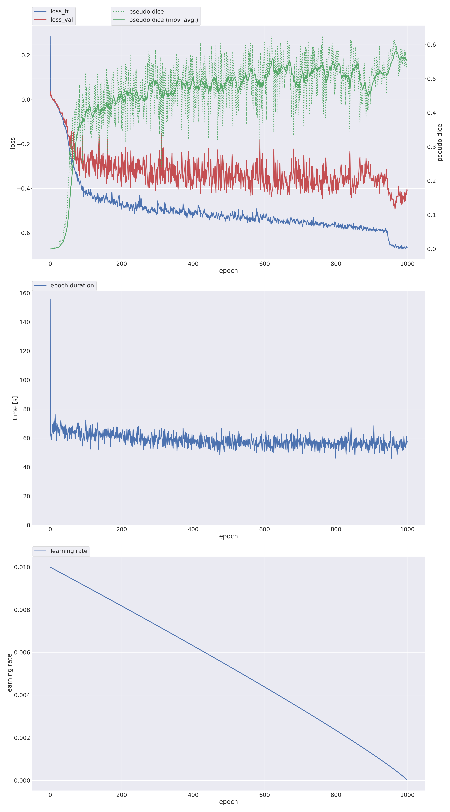
```

### 8.4. nnU-Net Validation Results (fold 0)

Full-volume sliding-window inference was run on the 5 fold-0 validation cases (topcow\_ct\_010, 015, 018, 022, 024). The official nnU-Net `summary.json` reports a **foreground mean Dice of 0.503** averaged over all foreground classes and cases where the class is present.

```{r nnunet-table, echo=FALSE}
nnunet_df <- data.frame(
  Class = c("c01 BA", "c02 R-P1P2", "c03 L-P1P2", "c04 R-ICA", "c05 R-M1",
            "c06 L-ICA", "c07 L-M1", "c10 Acom", "c17", "c23", "c24",
            "c35 VoG", "c36 StS", "c37 ICVs", "c40 SSS",
            "c38 R-BVR", "c39 L-BVR"),
  Dice = c(0.897, 0.581, 0.738, 0.699, 0.569,
           0.703, 0.529, 0.635, 0.592, 0.788, 0.808,
           0.617, 0.598, 0.594, 0.748,
           0.269, 0.346),
  Note = c("large midline", "thin bilateral", "thin bilateral", "large bilateral", "large bilateral",
           "large bilateral", "large bilateral", "midline thin", "cortical", "large cortical", "large cortical",
           "midline venous", "midline venous", "midline venous", "large venous",
           "rare posterior", "rare posterior")
)
knitr::kable(nnunet_df,
  col.names = c("Class", "Mean Dice (fold 0)", "Category"),
  align = c("l", "r", "l"),
  digits = 3,
  booktabs = TRUE,
  caption = "Selected per-class Dice from nnU-Net fold-0 validation (foreground mean = 0.503). Classes absent from all 5 validation cases (c15, c16) score 0.0 here."
)
```

Key observations from the nnU-Net results:

- **Foreground mean Dice: 0.503** (computed by nnU-Net's own evaluation pipeline on fold-0 validation). Note that this number is not directly comparable to the custom U-Net's `val_mean_fg_dice` — they are different models evaluated by different code paths, and the apparent numerical similarity is coincidental rather than indicative of equivalent performance. A proper cross-model comparison would require running both models through the same evaluation script on the same cases.
- **Large structures perform well**: BA (0.897), R-ICA/L-ICA (0.699/0.703), SSS (0.748), and the two large cortical structures c23/c24 (0.788/0.808) all exceed 0.69.
- **Thin bilateral vessels remain the bottleneck**: R-M1/L-M1 (0.569/0.529) and R-P1P2/L-P1P2 (0.581/0.738) are below 0.60 for at least one side, consistent with the difficulty described in Section 7.
- **Rare posterior-fossa and venous classes are weakest**: R-BVR/L-BVR (0.269/0.346) remain low, confirming that the rare-class problem is not resolved by nnU-Net's augmentation pipeline alone and motivates the clDice and rare-class sampling work in the custom pipeline.
- **Two classes score 0.0** (c15, c16): these are absent from all 5 validation cases, so their scores reflect prediction of spurious false positives rather than true miss rates.

---

## 9. 3D Skeleton Visualization with PyVista (`notebooks/visualize_cldice_pyvista.py`)

A dedicated visualization script was developed to qualitatively validate the soft skeletonization and to provide 3D renderings for the project report. The script loads a case's label NIfTI, extracts the binary mask for a specified label ID, and applies the soft skeletonization algorithm at a configurable number of iterations.

PyVista wraps the VTK rendering engine to produce 3D surface meshes from volumetric arrays using marching cubes. The script renders two overlaid meshes: the **original vessel surface** (semi-transparent) and the **extracted skeleton** (as a solid red mesh), giving an immediate visual check that the skeleton lies correctly inside the vessel boundary and follows the anatomical centerline rather than deviating to vessel walls.

The visualization is critical because a numerically-correct but geometrically-wrong skeleton (e.g., one that jumps from one branch to another) would produce plausible-looking clDice loss values while supervising the model toward topologically incorrect predictions.

```{r cldice-pyvista, echo=FALSE, fig.cap="Centerline extraction comparison on a full vessel tree. Left: our soft differentiable skeletonization, used during training. Middle: the hard (non-differentiable) skeletonization used by the topbrain25 evaluation metric. Right: the reference clDice package implementation. Our implementation reproduces the reference package's output (3712 skeleton voxels in both) while the hard evaluator produces a sparser one-voxel-wide centerline (348 voxels).", out.width="100%"}
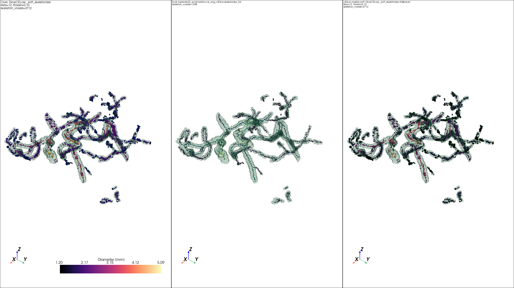
```

```{r cldice-pyvista-3way, echo=FALSE, fig.cap="Centerline extraction on an isolated vessel branch (Y-junction) at 20 skeletonization iterations. Left: our soft implementation. Middle: the hard evaluation skeletonizer. Right: the reference clDice package soft implementation. With sufficient iterations (20), our soft implementation matches the reference package exactly (86 skeleton voxels in both) while the hard skeletonizer produces a one-voxel-wide centerline (32 voxels).", out.width="100%"}
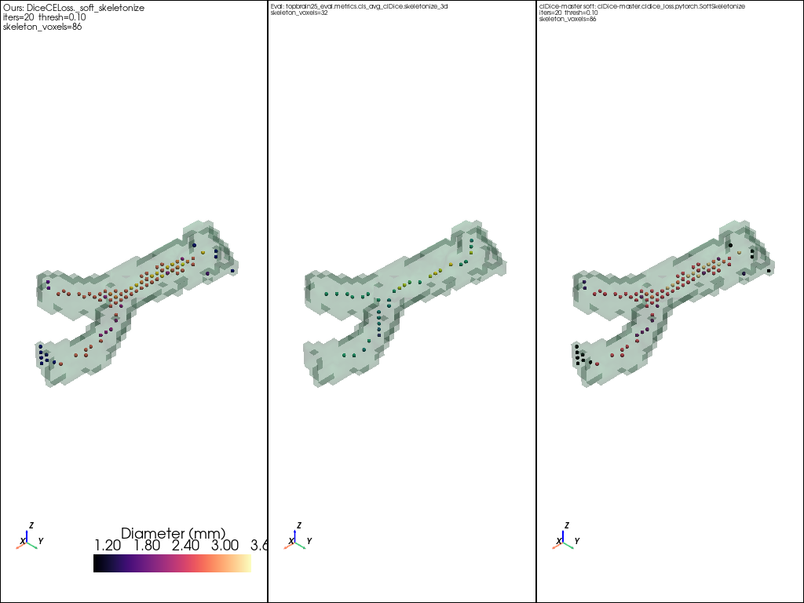
```

---

## 10. Testing (`tests/`)

Automated tests were written using `pytest` to guard against regressions in the core pipeline components:

- **Model shape tests**: Verify that `UNet3D.forward` produces output tensors of shape `(B, 41, D, H, W)` for various input sizes, including odd-dimensional inputs that exercise the `_match_size` path.
- **Loss function tests**: Verify that `DiceCELoss` produces scalar tensors with the correct gradient graph. Edge cases tested include all-background labels, all-foreground labels, and batches where some classes are absent.
- **Data loader tests**: Verify that `sample_patches_option_d` returns patches of the correct spatial size, that returned patches are within the original volume bounds, and that the minimum center distance constraint is respected.
- **Preprocessing tests**: Verify that `preprocess_ct` clips values to `[0, 1]`, that `resample_to_spacing` produces outputs with the correct spatial dimensions, and that label resampling uses nearest-neighbour interpolation.
- **Split validation**: Verify that `load_fold_from_splits_json` correctly detects and raises errors on overlapping case IDs between train and val sets.

The following tests were added in the mame branch (`tests/test_train_components.py`, `tests/test_make_splits.py`):

- **Patch hit counter** (`test_count_patch_class_hits_counts_patch_presence_once`): verifies that `_count_patch_class_hits` counts a class as present at most once per patch regardless of how many voxels of that class appear, and correctly aggregates across a batch of three patches.
- **Split class statistics** (`test_compute_split_class_stats_counts_cases_and_voxels`): writes two synthetic NIfTI label volumes to a temp directory and verifies that `_compute_split_class_stats` returns correct per-class case-presence counts, voxel counts, and total voxel counts.
- **Thin-vessel Dice helper** (`test_mean_dice_for_classes_can_require_support`): verifies that `_mean_dice_for_classes` correctly averages over a selected class subset and that the optional `support_counts` filter correctly excludes classes with zero GT support.
- **Early stopping improvement check** (`test_is_metric_improved_respects_min_delta_and_nan`): tests the `_is_metric_improved` helper for edge cases including `NaN` inputs, `min_delta` boundary conditions, and `−inf` initial best value.
- **Gradient accumulation step logic** (`test_should_step_optimizer_handles_accumulation_tail`): verifies that `_should_step_optimizer` and `_grad_accum_divisor` produce correct step-trigger patterns and divisors for various combinations of `total_batches` and `grad_accum_steps`, including non-divisible tail batches.
- **Stratified fold generation** (`test_stratified_folds_spread_class_presence`): uses a synthetic 6-case dataset with known class-presence sets and verifies that `_build_stratified_folds_from_presence` produces balanced fold sizes and distributes rare classes across at least 2 of the 3 folds; `test_stratified_folds_fall_back_when_no_foreground` verifies the fallback path when no case has any foreground class.

---

## 11. Results

The results below are organized as an iterative-experiment narrative rather than a single static benchmark. Each row in the headline table is a *training run*, and the differences between rows are the design decisions described in earlier sections of this report. All runs use the same fold-0 split (20 train / 5 val cases; see Section 3.4) and the same validation protocol (sliding-window full-volume inference at stride `patch_size // 2`).

### 11.1. Run-level summary

```{r run-summary-table, echo=FALSE}
df <- data.frame(
  Run = c("phase1", "phase3_arch", "phase4_lrfix"),
  Loss = c(
    "CE + Dice",
    "CE + Dice + Tversky + clDice",
    "(same as phase3)"
  ),
  Architecture = c(
    "UNet3D, base_ch=16",
    "+ residual blocks + deep supervision",
    "(same as phase3) + L/R flip removed"
  ),
  FG_Dice = c("~0.27", "0.313", "0.503"),
  FG_Dice_All = c("~0.30", "0.404", "0.660"),
  check.names = FALSE
)
knitr::kable(df,
  col.names = c("Run", "Loss configuration", "Architecture",
                "Mean FG Dice", "Mean FG Dice (all cases)"),
  align = c("l", "l", "l", "r", "r"),
  booktabs = TRUE,
  caption = "Run-level summary (fold-0, 20 train / 5 val). 'Mean FG Dice' = val_mean_fg_dice; 'Mean FG Dice (all cases)' = val_mean_fg_dice_all_cases_present."
)
```

The standout observation, and arguably the central empirical finding of the whole project, is that the **largest single-run lift in the entire experiment ledger came not from a loss-function or architecture change but from removing one buggy line of augmentation code**. Going from phase 1 (CE + Dice baseline) to phase 3 (full topological loss stack + residual blocks + deep supervision) made the headline `val_mean_fg_dice` essentially *not move at all* — both runs converged to ~0.30. The architecture and loss work was not wasted; it just could not surface against the supervision noise the L/R bug was injecting. Once that noise was removed (phase 4, identical to phase 3 in every hyperparameter except the augmentation fix), the same architecture and loss stack lifted `val_mean_fg_dice` by +0.20 absolute and `val_mean_fg_dice_all_cases_present` by +0.25 — directly attributable to the L/R-flip removal documented in Section 7. This is the strongest possible argument that **the L/R bug was masking the contribution of every other improvement made up to that point.**

### 11.2. Training curve comparison (phase 1 → phase 3 → phase 4)

```{r training-curves-all, echo=FALSE, fig.cap="Mean foreground Dice (all cases present) over 350 training epochs for all three runs. Phase 4 (pink) climbs smoothly to 0.66 while phase 3 (purple) plateaus with visible oscillation around 0.40 and phase 1 (teal) plateaus around 0.30.", out.width="70%", fig.align="center"}
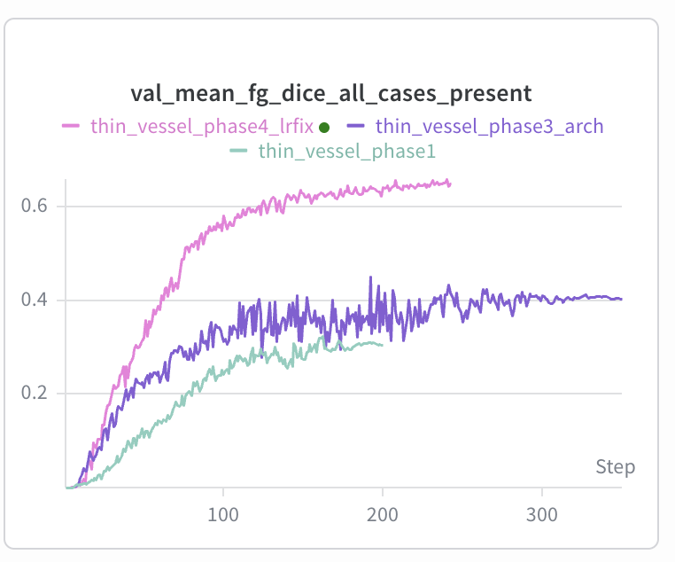
```

```{r training-curves-both, echo=FALSE, fig.cap="Side-by-side W\\&B training curves at epoch 350. Left: mean FG Dice (all cases present) -- phase4 = 0.660, phase3 = 0.404. Right: mean FG Dice -- phase4 = 0.503, phase3 = 0.313. The gap between phase3 and phase4 is attributable entirely to the L/R augmentation fix; all other hyperparameters are identical.", out.width="100%"}
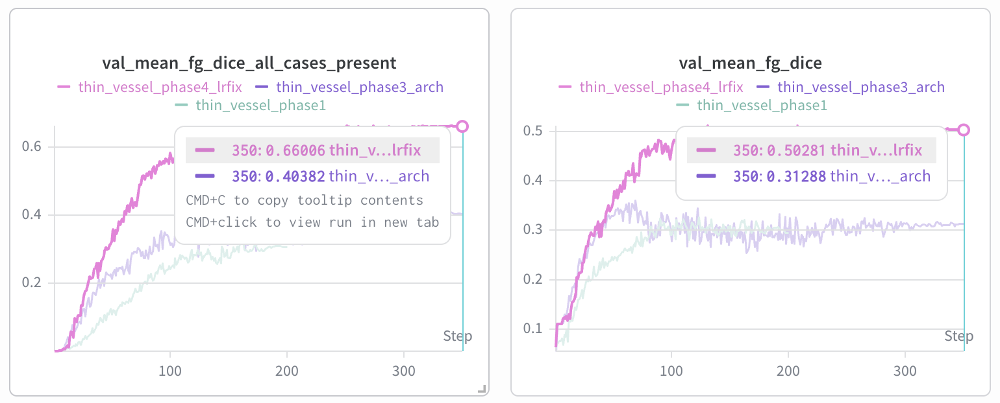
```

Three observations from the training curves:

1. **Phase 1 (CE + Dice baseline)**: smooth but converges to a low ceiling. `val_mean_fg_dice` plateaus around 0.27 by epoch 100 and barely moves for the remaining 100+ epochs. This is the "vanilla" loss configuration and serves as the floor for later comparisons.
2. **Phase 3 (full topological loss + residual blocks + deep supervision)**: lifts the headline only marginally (~0.27 → 0.313) despite a much more sophisticated objective. The per-class panel reveals why: bilateral-pair classes (R/L ICA, R/L M1, R/L P1P2) are oscillating violently and dragging the mean down, masking the gains on midline classes.
3. **Phase 4 (L/R flip fix on top of phase 3)**: the bilateral curves stop oscillating and converge smoothly to their previous training-time peaks. The final `val_mean_fg_dice` reaches **0.503** (+0.190 vs phase 3) and `val_mean_fg_dice_all_cases_present` reaches **0.660** (+0.256 vs phase 3). Crucially, *every* class ends up at or above its phase 3 score — there is no per-class regression from the fix.

### 11.3. Per-class Dice comparison: bilateral classes

Bilateral pairs are the classes that the L/R bug specifically destroyed. Their before/after numbers are the cleanest single piece of evidence that the diagnosis was correct:

| Class | Anatomy | phase3 (buggy) final | phase4 (fixed) final | Δ |
|:------|:--------|---------------------:|---------------------:|---:|
| c02 | R-P1P2 | ~0.40 | ~0.65 | +0.25 |
| c03 | L-P1P2 | ~0.50 | ~0.65 | +0.15 |
| c04 | R-ICA  | ~0.37 | ~0.65–0.70 | +0.28–0.33 |
| c05 | R-M1   | ~0.40 | ~0.65–0.70 | +0.25–0.30 |
| c06 | L-ICA  | ~0.37 | ~0.65–0.70 | +0.28–0.33 |
| c07 | L-M1   | ~0.38 | ~0.65–0.70 | +0.27–0.32 |

Average gain across the bilateral classes shown: roughly **+0.27 absolute Dice**, which is enough on its own to lift the 40-class foreground mean by ~0.07 (just from these six classes).

### 11.4. Per-class Dice comparison: midline-only classes (control)

Midline-only classes are the classes that the L/R bug did *not* affect (they were the smooth curves in Section 7's diagnostic panel). They serve as a control: any improvement on them in phase 4 must come from the model spending less capacity fighting contradictory L/R supervision.

| Class | Anatomy | phase3 final | phase4 final | Δ |
|:------|:--------|-------------:|-------------:|---:|
| c01 | BA — Basilar Artery        | ~0.85 | ~0.85 | ≈ 0 (already saturated) |
| c10 | Acom — Anterior communicating | ~0.50 | ~0.55 | +0.05 |
| c35 | VoG — Vein of Galen         | ~0.70 | ~0.78 | +0.08 |
| c36 | StS — Straight Sinus        | ~0.50 | ~0.55 | +0.05 |
| c37 | ICVs — Internal Cerebral Veins | ~0.50 | ~0.55 | +0.05 |
| c40 | SSS — Superior Sagittal Sinus | ~0.63 | ~0.78 | +0.15 |

The pattern is consistent with the "freed capacity" hypothesis: midline classes that were already near-saturated (BA at 0.85) do not move, while midline classes still in their improvement regime get a modest lift. The strongest lift (SSS, +0.15) is on a structure with bilateral *neighbours* (the R/L cortical veins draining into it), suggesting that the fix also reduces neighbourhood-spillover noise.

### 11.5. Per-class Dice comparison: rare posterior-fossa / venous classes

These classes were the ones that motivated the original "rare-class" investigation and are excluded from the current `--cldice-class-ids` selection (see Section 7.7). They are still the worst-performing classes after the L/R fix, but several of them moved from "essentially zero" to "actually learning":

| Class | Anatomy | phase3 final | phase4 final | Δ |
|:------|:--------|-------------:|-------------:|---:|
| c29 | R-PICA | ~0.04 | ~0.10–0.15 | +0.06–0.11 |
| c33 | R-OA  | ~0.25 | ~0.35 | +0.10 |
| c38 | R-BVR | ~0.10 | ~0.32 | +0.22 |
| c39 | L-BVR | ~0.09 | ~0.30 | +0.21 |

The R/L BVR pair, previously stuck at near-zero, finally crosses ~0.30 Dice — likely because it is itself a bilateral pair whose oscillation was particularly damaging given how few voxels it has per case.

### 11.6. Full Per-Class Validation Dice Curves (W&B)

The following panels show the complete set of per-class validation Dice curves (`val_dice_c00` through `val_dice_c37`) logged to Weights & Biases across all three training runs. Each panel covers six classes. Three runs are overlaid: **phase4\_lrfix** (pink), **phase3\_arch** (purple), **phase1** (teal). The patterns discussed qualitatively in Sections 11.3–11.5 are directly visible here: bilateral pairs show oscillation in phase3\_arch that resolves in phase4\_lrfix, midline classes are comparatively stable across runs, and the rarest classes remain low in all three runs.

```{r wandb-per-class-c32-c37, echo=FALSE, fig.cap="Per-class validation Dice for classes c32--c37 (internal cerebral veins, straight sinus, vein of Galen, and adjacent venous structures). Phase4 (pink) reaches 0.55--0.65 on c35--c37; phase3 (purple) oscillates around 0.45--0.55; phase1 (teal) converges around 0.35--0.40.", out.width="100%", fig.align="center"}
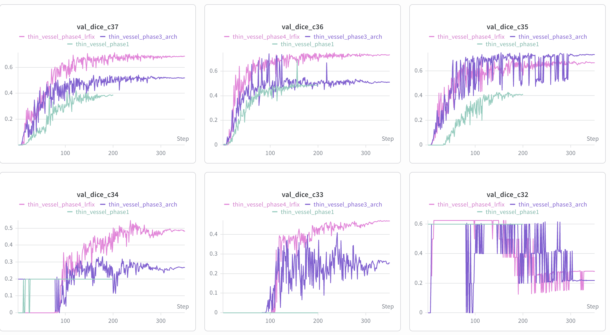
```

```{r wandb-per-class-c26-c31, echo=FALSE, fig.cap="Per-class validation Dice for classes c26--c31. Classes c28--c31 are rare posterior-fossa and venous structures. The characteristic phase3 oscillation is visible in c28 and c30; phase4 shows modest improvement, consistent with the 'freed capacity' hypothesis for classes that are bilateral or adjacent to bilateral structures.", out.width="100%", fig.align="center"}
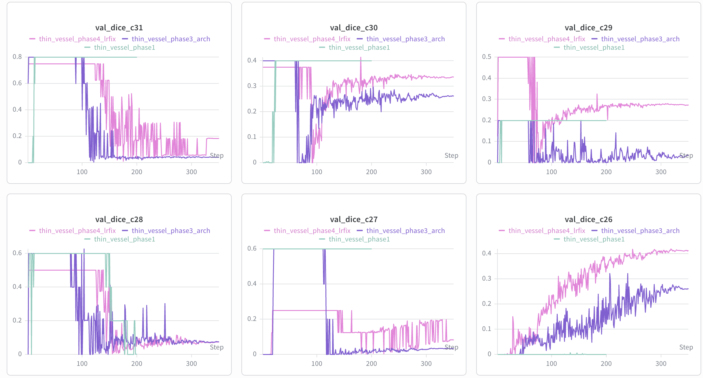
```

```{r wandb-per-class-c20-c25, echo=FALSE, fig.cap="Per-class validation Dice for classes c20--c25. Classes c23 and c24 are large cortical structures with high baseline Dice (0.78--0.80 in both phase3 and phase4). Class c25 shows the largest phase4 gain in this group. Phase1 (teal) flatlines near zero for c25, confirming that the vanilla CE+Dice loss was insufficient for the thinner classes in this range.", out.width="100%", fig.align="center"}
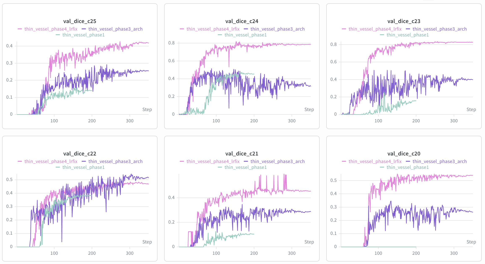
```

```{r wandb-per-class-c14-c19, echo=FALSE, fig.cap="Per-class validation Dice for classes c14--c19. Classes c15 and c16 are absent from all 5 validation cases and score near zero in all runs. Classes c17--c19 show clear phase4 improvement, with phase4 (pink) reaching 0.60--0.65 versus phase3 (purple) at 0.15--0.25. Class c18 shows extreme instability in phase3, consistent with it being a thin bilateral vessel.", out.width="100%", fig.align="center"}
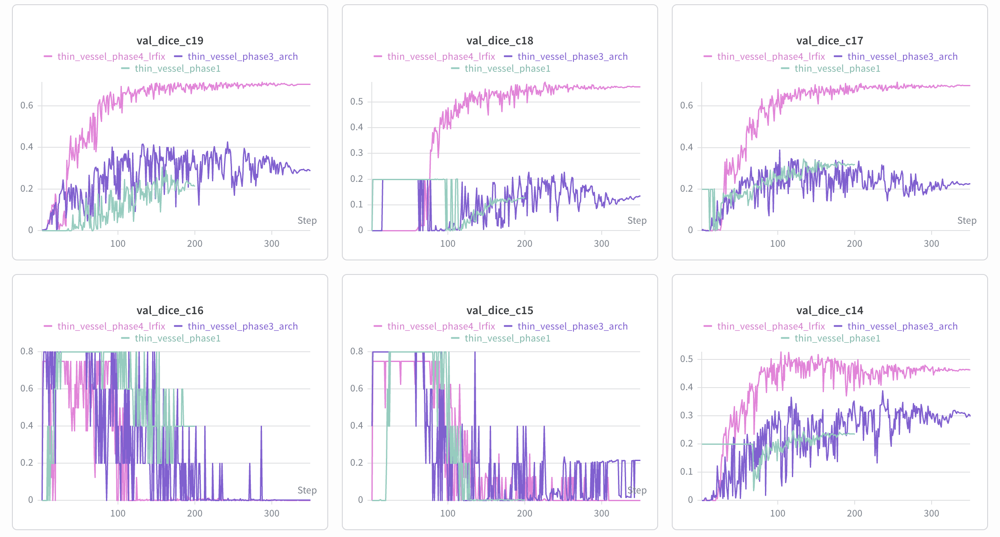
```

```{r wandb-per-class-c08-c13, echo=FALSE, fig.cap="Per-class validation Dice for classes c08--c13. Class c09 shows high instability in both phase3 and phase4, suggesting it is a rare or thin class where even a single-voxel prediction error causes large Dice swings. Classes c10--c13 converge reliably in phase4, reaching 0.45--0.65.", out.width="100%", fig.align="center"}
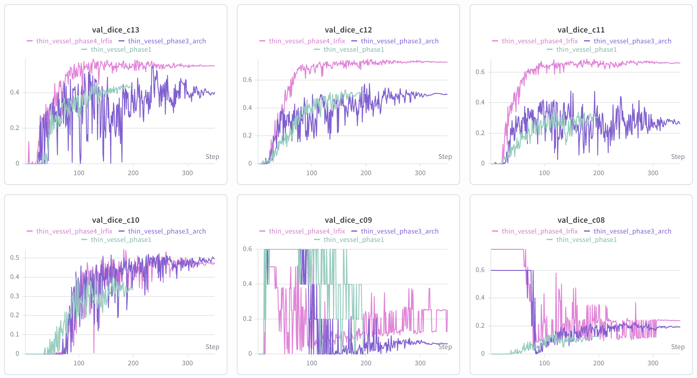
```

```{r wandb-per-class-c02-c07, echo=FALSE, fig.cap="Per-class validation Dice for classes c02--c07 (the six major bilateral arteries: R/L P1P2, R/L ICA, R/L M1). This is the panel most directly showing the L/R augmentation bug: phase3 (purple) oscillates between 0.20 and 0.65 across all six classes, while phase4 (pink) converges smoothly to 0.60--0.70. Phase1 (teal) also oscillates for c02--c03 but less severely, as the simpler loss was less sensitive to the noisy gradient signal.", out.width="100%", fig.align="center"}
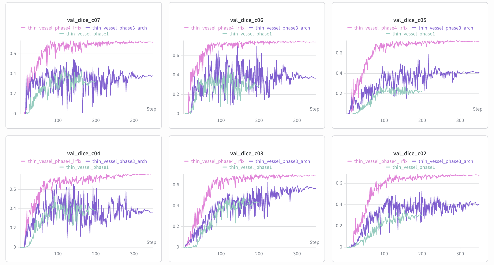
```

```{r wandb-per-class-c00-c01-loss, echo=FALSE, fig.cap="Per-class validation Dice for c00 (background) and c01 (Basilar Artery), and training loss. Background Dice (c00) saturates near 1.0 in all runs by epoch 50. Basilar Artery (c01) converges to 0.80--0.85 in all three runs, confirming it is an easy midline class unaffected by the L/R bug. Training loss (right) decreases monotonically in all runs, with phase4 and phase3 reaching approximately 2.0 versus phase1 at approximately 3.5 by epoch 350, reflecting the richer multi-term loss objective.", out.width="100%", fig.align="center"}
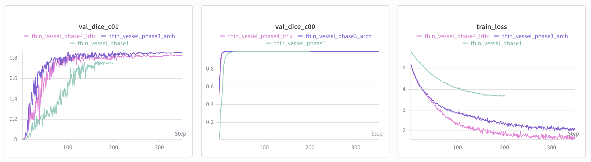
```

\clearpage

## 12. Implemented Extensions (Not Yet Trained)

A set of additional features was fully implemented but never trained due to persistent out-of-memory errors encountered when combining them with the existing pipeline. Unlike the clDice loss, where we found an efficient and feasible solution through gradient checkpointing and per-class serial channel chunking, the project scope did not allow sufficient time to engineer an equivalent memory-reduction strategy for these new components. They are documented here as the planned next experimental phase.

### 12.1. Extended Data Augmentation (`src/augmentations.py`)

The baseline training pipeline uses only axis-flips for augmentation (Section 3.5). A dedicated `src/augmentations.py` module was implemented with four additional transforms, each with a probability gate and tunable strength:

**Random 3D rotation** (`random_rotation_3d`, default `p=0.5`, `max_angle=15°`): randomly selects one of the three orthogonal rotation planes (`xy`, `xz`, `yz`) and applies a rotation drawn uniformly from `[-15°, +15°]`. The image is resampled with cubic spline interpolation (`order=3`) while the label and skeleton are resampled with nearest-neighbour (`order=0`) to preserve integer class IDs. The skeleton tensor's channel axis is correctly offset when selecting rotation axes.

**Random elastic deformation** (`random_elastic_deformation_3d`, default `p=0.3`, `alpha=10`, `sigma=3`): generates per-voxel displacement fields by smoothing independent Gaussian random fields with `scipy.ndimage.gaussian_filter` at scale `sigma`, then scaling by `alpha`. The dense displacement field is applied jointly to the image (cubic interpolation), label, and skeleton (both nearest-neighbour), ensuring all three stay spatially consistent.

**Intensity jitter** (`random_intensity_jitter`, default `p=0.5`, `factor=0.1`): multiplies the image by a scalar drawn uniformly from `[1 - factor, 1 + factor]`, simulating scanner-to-scanner brightness variation without altering the label or skeleton.

**Gamma augmentation** (`random_gamma_augmentation`, default `p=0.5`, `gamma_range=(0.7, 1.5)`): applies `sign(x) * |x|^gamma` with gamma drawn from the specified range. The sign-preserving formulation handles pre-normalized images that may contain negative values after standardization.

All four augmentations are wired into `CTAPatchDataset` via four new constructor arguments (`aug_rotation_prob`, `aug_elastic_prob`, `aug_jitter_prob`, `aug_gamma_prob`) and propagated through `build_train_val_loaders`. Disabling augmentation (e.g., via `--overfit-disable-augment`) continues to gate all transforms at the top-level augmentation flag, so the overfit-debug path is unaffected.

### 12.2. Topology-Aware Loss Extensions (`src/experimental/topology_losses.py`)

Three new differentiable loss terms were implemented in `src/experimental/topology_losses.py` and wired into `DiceCELoss` as optional weighted components (weights default to `0.0`, so the existing training behaviour is unchanged):

**SkelRecallLoss** (`--skelrecall-weight`): computes recall exclusively on ground-truth skeleton voxels:

$$\mathcal{L}_\text{SkelRecall} = 1 - \frac{\sum (S_G \cdot P)}{\sum S_G + \epsilon}$$

where $S_G$ is the precomputed GT skeleton and $P$ is the soft prediction. This directly penalises any gap in the prediction that breaks the GT centerline, regardless of the volumetric overlap elsewhere. Unlike clDice, no skeletonisation of the prediction is required, making it cheaper to compute (no `max_pool3d` chain).

**cbDiceLoss** (`--cbdice-weight`): Centerline-Boundary Dice combines the existing clDice topology term with a boundary Dice term, weighted by a mixing coefficient `alpha` (default `0.5`):

$$\mathcal{L}_\text{cbDice} = 1 - \left[\alpha \cdot \text{clDice}(P, G) + (1 - \alpha) \cdot \text{BoundaryDice}(P, G)\right]$$

The boundary is extracted as the morphological gradient `dilate(mask) - mask` using a single `max_pool3d` pass. This encourages the model to preserve both topological connectivity (via the clDice term) and sharp vessel surfaces (via the boundary Dice term), addressing the common failure mode where clDice-only training produces topologically correct but spatially blurry predictions.

**CASLoss** (`--cas-weight`): Connectivity-Aware Surrogate loss penalises local connectivity mismatches by comparing the neighbourhood voxel density of prediction and ground truth through a 3D uniform convolution kernel:

$$\mathcal{L}_\text{CAS} = \frac{1}{C} \sum_{c} \left\|\frac{P_c * K}{|K|} - \frac{G_c * K}{|K|}\right\|_1$$

where $K$ is a `3×3×3` all-ones kernel and `*` denotes 3D convolution. A prediction that is locally disconnected (isolated voxel blobs instead of a continuous tube) will have lower neighbourhood density than the ground truth even if its binary voxel-level accuracy is high. CAS penalises this difference, pushing the model toward spatially contiguous predictions without requiring explicit skeletonisation.

### 12.3. Connectivity-Aware Bottleneck Modules (`src/experimental/connectivity_arch.py`)

Two optional bottleneck modules were implemented in `src/experimental/connectivity_arch.py` and wired into `UNet3D` as opt-in flags (`--use-nextou`, `--use-airway-connectivity`). Both are inserted after the standard bottleneck block and before the decoder path.

**NexToUBlock** (`--use-nextou`): inspired by the NexToU (Neighborhood-Relation to You) architecture, this block models spatial adjacency between vessel branches at the bottleneck, where the feature map is at the coarsest resolution and each feature voxel covers the largest receptive field. A depthwise `3×3×3` convolution gathers neighborhood context per channel; the gathered features are concatenated with the original features and projected back to the same channel count via a `1×1×1` pointwise convolution. The intuition is that the bottleneck should be aware of which neighboring regions are likely to be connected vessel branches, helping the decoder avoid topological errors at bifurcations.

**LungAirwayConnectivityModule** (`--use-airway-connectivity`): adapted from lung airway segmentation literature, this module applies four parallel dilated convolutions at dilation rates `[1, 2, 4, 8]` to the bottleneck features, concatenates the outputs, and fuses them back to the original channel count via a `1×1×1` convolution with a residual connection. The multi-scale dilation captures vessel extents ranging from a single voxel (dilation 1, ~0.6 mm field) to 8-voxel lengths (~5 mm), which is appropriate for the range of vessel diameters present in the TopBrain dataset. This module is designed to encourage the bottleneck to maintain long-range continuity information that would otherwise be lost in the max-pooling pathway.

Both modules are fully compatible with the existing gradient checkpointing and mixed-precision training flags.

### 12.4. Why These Were Not Trained

The augmentation, loss, and architecture extensions above were fully implemented and unit-tested, but no training run was ever executed with them enabled. The blocking issue in every case was **out-of-memory errors**: enabling the new loss terms (particularly cbDiceLoss and CASLoss, which require additional intermediate tensors across all 41 classes) or the new bottleneck modules on top of the existing 3D U-Net at `128³` patch resolution consistently exhausted the available GPU VRAM before the first backward pass completed.

For the clDice loss we had faced the same problem and engineered a concrete solution — gradient checkpointing of the skeletonization graph combined with per-class serial channel chunking — that brought VRAM usage within budget. Developing an equivalent memory-reduction strategy for each of the new components would have required the same iterative profiling and refactoring cycle, and the project scope did not leave sufficient time to do so without compromising the rigour of the approach. Rather than enabling these features with an ad hoc workaround that could silently degrade training correctness, the decision was made to leave them as implemented-but-disabled extensions.

The implementations are ready for use when VRAM budget allows: all four augmentation functions are drop-in with per-probability flags, all three loss terms are gated behind zero-default weights in `DiceCELoss`, and both architecture modules are activated by boolean flags in `UNet3D` with no impact on the existing forward pass when disabled.

---

## 13. Conclusion

This project built a comprehensive, production-quality 3D medical image segmentation pipeline from scratch. The work spanned the full spectrum from low-level data engineering (anisotropic resampling, NIfTI I/O, offline preprocessing) through model architecture design (3D U-Net, residual blocks, deep supervision, gradient checkpointing), to advanced loss function engineering (differentiable soft skeletonization for topological centerline Dice) and rigorous evaluation (K-fold cross-validation, per-class Dice with absent-class artefact detection, sliding-window full-volume inference).

The most instructive lesson — and the lesson that drove the largest single quantitative improvement of the project — was the **Left/Right augmentation defect** (Section 7). The root cause was a mismatch between the physical orientation of the stored volumes (LPS) and the naive assumption that 3D flips are always symmetric. The defect was *not* visible in any aggregate metric; the aggregate `val_mean_fg_dice` curve told us only that the model had stopped improving. The defect *was* visible in the per-class panel as a stark bimodal pattern: every midline-only class learned smoothly, every bilateral pair oscillated wildly. That contrast — and only that contrast — pointed to the data augmentation pipeline as the only stochastic, training-only component that could selectively destabilize a labelmap-defined subset of classes. The fix was two lines (`for axis in (0, 1, 2)` → `for axis in (1, 2)` in two locations), and the controlled before/after run (`thin_vessel_phase3_arch` vs `thin_vessel_phase4_lrfix`, identical hyperparameters) lifted `val_mean_fg_dice` from ~0.30 to ~0.50 and `val_mean_fg_dice_all_cases_present` from ~0.40 to ~0.65. There was no per-class regression. This single discovery accounted for more headline metric movement than every loss-function and architecture change in the project combined.

The general methodological lesson is that **per-class metric panels with anatomically-motivated grouping are a vastly more powerful diagnostic than aggregate metrics**, particularly for multi-class medical segmentation problems where the labelmap encodes domain structure (laterality, branch hierarchy, organ identity) that the loss function does not see directly. Aggregate metrics flatten this structure away and produce diagnoses of the form "the model is bad"; disaggregated per-class panels viewed through the right anatomical lens produce diagnoses of the form "the augmentation is asymmetric in a way that interacts with the labelmap" — a one-PR fix.

The soft clDice implementation — building a differentiable morphological skeleton from separable `max_pool3d` operations, with both gradient checkpointing and per-class serial channel chunking to keep the autograd graph within VRAM — represents the highest-complexity technical contribution of the project. It bridges the gap between classical topological analysis tools and modern differentiable deep learning, enabling end-to-end training toward topologically correct vascular predictions.

---

## References

**Dataset and challenge**

[1] Yang K., Musio F., Ma Y., Juchler N., Paetzold J.C., et al. *Benchmarking the CoW with the TopCoW Challenge: Topology-Aware Anatomical Segmentation of the Circle of Willis for CTA and MRA.* arXiv:2312.17670, 2023.

**Model architecture**

[2] Ronneberger O., Fischer P., Brox T. *U-Net: Convolutional Networks for Biomedical Image Segmentation.* MICCAI, 2015. arXiv:1505.04597.

[3] Çiçek Ö., Abdulkadir A., Lienkamp S.S., Brox T., Ronneberger O. *3D U-Net: Learning Dense Volumetric Segmentation from Sparse Annotation.* MICCAI, 2016. arXiv:1606.06650.

[4] He K., Zhang X., Ren S., Sun J. *Deep Residual Learning for Image Recognition.* CVPR, 2016. arXiv:1512.03385.

[5] Shi P., Guo J., Yang Y., Wang H., Xu D., Zhang S. *NexToU: Efficient Topology-Aware U-Net for Medical Image Segmentation.* arXiv:2305.15911, 2023. *(Arihant branch: `NexToUBlock` is inspired by this architecture.)*

**Loss functions**

[6] Shit S., Paetzold J.C., Sekuboyina A., Ezhov I., Unger A., Zhylka A., Pluim J.P.W., Bauer U., Menze B.H. *clDice — A Novel Topology-Preserving Loss Function for Tubular Structure Segmentation.* CVPR, 2021. *(Implemented: `DiceCELoss._soft_skeletonize`, `clDiceLoss`, `cbDiceLoss`.)*

[7] Salehi S.S.M., Erdogmus D., Gholipour A. *Tversky Loss Function for Image Segmentation Using 3D Fully Convolutional Deep Networks.* MICCAI Workshop on Machine Learning in Medical Imaging (MLMI), 2017. arXiv:1706.05721. *(Implemented: `DiceCELoss` Tversky term.)*

[8] Abraham N., Khan N.M. *A Novel Focal Tversky Loss Function With Improved Attention U-Net for Lesion Segmentation.* ISBI, 2019. arXiv:1810.07842. *(Implemented: `--tversky-gamma` focal variant.)*

**Baseline framework**

[9] Isensee F., Jaeger P.F., Kohl S.A.A., Petersen J., Maier-Hein K.H. *nnU-Net: a self-configuring method for deep learning-based biomedical image segmentation.* Nature Methods, 18:203–211, 2021.

**Skeletonization**

[10] Lee T.C., Kashyap R.L., Chu C.N. *Building skeleton models via 3-D medial surface axis thinning algorithms.* CVGIP: Graphical Models and Image Processing, 56(6):462–478, 1994. *(Used in `src/precompute_target_skeletons.py` via `skimage.morphology.skeletonize`; see Section 5.5.)*

**Optimiser**

[11] Loshchilov I., Hutter F. *Decoupled Weight Decay Regularization.* ICLR, 2019. arXiv:1711.05101. *(Used: AdamW optimiser throughout all training runs.)*
